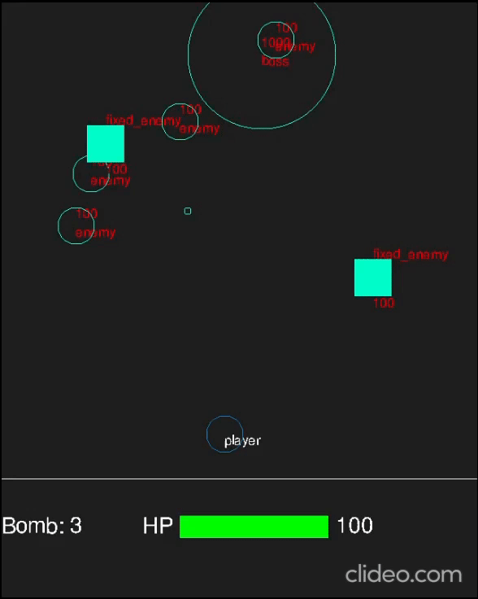
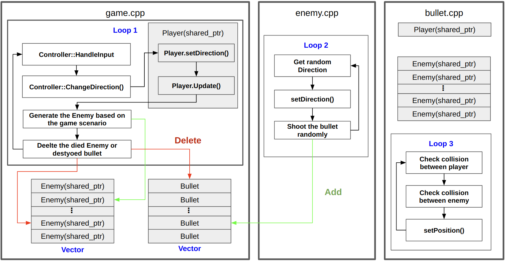
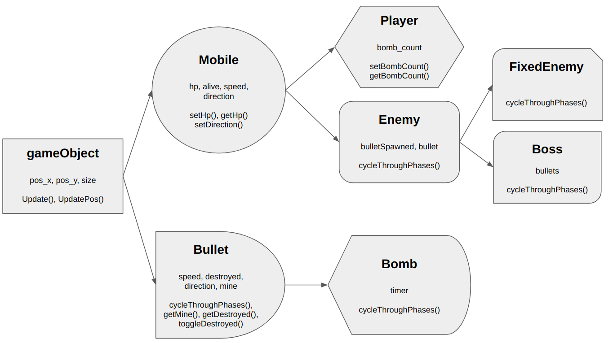

# Cpp-Shooting-Game
The project is 2D arcade shooting using C++ SDL. 

Table of contents
=================
<!--ts-->
   * [Dependencies for Running Locally](#dependencies-for-running-locally)
   * [Basic Build Instructions](#basic-build-instructions)
   * [How to play](#how-to-play)
   * [Processing loop](#processing-loop)
   * [Object Hierarchy](#object-hierarchy)
   * [Rubric Points](#rubric-points)
      * [Loops, Functions, I/O](#loops-functions-io)
      * [Object Oriented Programming](#object-oriented-programming)
      * [Memory Management](#memory-management)
      * [Concurrency](#concurrency)
<!--te-->

## Dependencies for Running Locally
* cmake >= 3.7
  * All OSes: [click here for installation instructions](https://cmake.org/install/)
* make >= 4.1 (Linux, Mac), 3.81 (Windows)
  * Linux: make is installed by default on most Linux distros
  * Mac: [install Xcode command line tools to get make](https://developer.apple.com/xcode/features/)
  * Windows: [Click here for installation instructions](http://gnuwin32.sourceforge.net/packages/make.htm)
* SDL2 >= 2.0
  * All installation instructions can be found [here](https://wiki.libsdl.org/Installation)
  >Note that for Linux, an `apt` or `apt-get` installation is preferred to building from source. 
* gcc/g++ >= 5.4
  * Linux: gcc / g++ is installed by default on most Linux distros
  * Mac: same deal as make - [install Xcode command line tools](https://developer.apple.com/xcode/features/)
  * Windows: recommend using [MinGW](http://www.mingw.org/)
* SDL2_ttf >= 2.0
  * All installation instructions can be found [here](https://wiki.libsdl.org/SDL2_ttf)
  > sudo apt-get install libsdl2-ttf-dev

## Basic Build Instructions
1. Clone this repo.
2. Make a build directory in the top level directory: `mkdir build && cd build`
3. Compile: `cmake .. && make`
4. Run it: `./ShootingGame`.

## How to play
| Key  | Action |
| ------------- | ------------- |
| Up  | Move to Upside  |
| Down  | Move to Downside  |
| Left  | Move to Leftside  |
| Right  | Move to Right side  |
| A  | Use Normal Weapon  |
| B  | Use Bomb Weapon  |
| ESC  | Exit Game  |

## Processing loop

## Object Hierarchy

## Rubric Points
Below are the rubric points that are addressed/implemented in this project.

### Loops, Functions, I/O
* The project demonstrates an understanding of C++ functions and control structures
* The project accepts user input and processes the input

### Object Oriented Programming
* The project uses Object Oriented Programming techniques.
* Classes use appropriate access specifiers for class members.
* Class constructors utilize member initialization lists.
* Classes abstract implementation details from their interfaces.
* Classes encapsulate behavior.
* Classes follow an appropriate inheritance hierarchy.
* Overloaded functions allow the same function to operate on different parameters.
* Derived class functions override virtual base class functions.

### Memory management
* The project uses destructors appropriately.
* The project uses smart pointers instead of raw pointers.

### Concurrency
* The project uses multithreading.
* A mutex or lock is used in the project.
